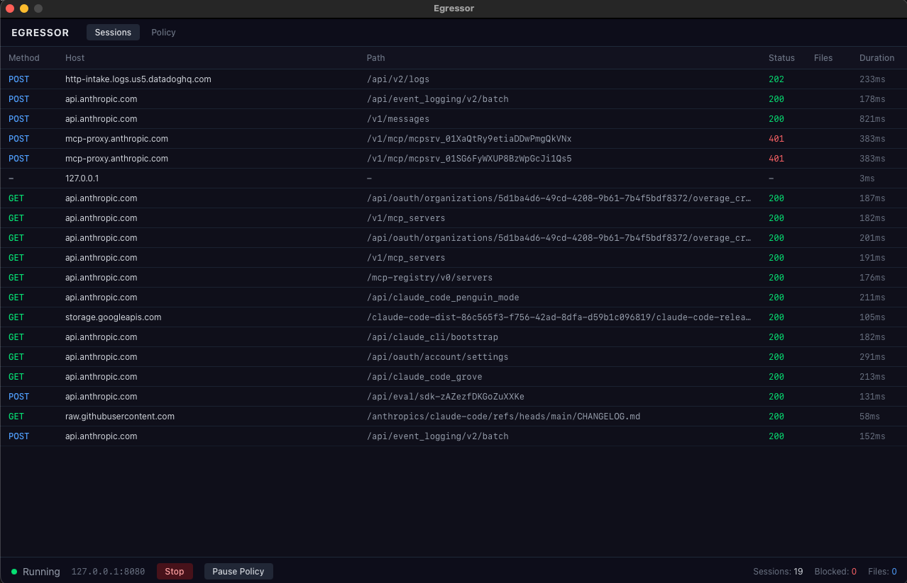

# Egressor

**Local-first egress monitoring and control for developer tools**

---

## What it does

Egressor is a local HTTPS proxy that intercepts outbound traffic from developer tools (Claude Code, Kiro, Cursor, etc.), showing you exactly what data — including which files — are being sent to LLM APIs.

- **TLS interception** — decrypts and inspects HTTPS payloads via a local CA
- **File detection** — identifies file paths and contents in API request bodies
- **File blocking** — prevents sensitive files (`.env`, `.pem`, secrets) from being sent
- **Desktop UI** — real-time session inspector with request/response viewer
- **Audit logging** — structured JSON logs with automatic rotation

```
Developer Tool  ──HTTPS──►  Egressor  ──HTTPS──►  LLM API
                            (inspect)
                            (detect files)
                            (block if denied)
                            (log everything)
```


---

## Quick Start

### Install

**Homebrew:**
```bash
brew tap ehsaniara/tap
brew install egressor
```

**From source:**
```bash
git clone https://github.com/ehsaniara/egressor.git
cd egressor
cd internal/ui/frontend && npm install && npm run build && cd ../../..
CGO_LDFLAGS="-framework UniformTypeIdentifiers" go build -tags production -o egressor ./cmd/egressor
```

### Setup

On first run, Egressor auto-generates a CA certificate and prints trust instructions:

```bash
./egressor
```

Trust the CA (required for TLS interception):
```bash
sudo security add-trusted-cert -d -r trustRoot \
  -k /Library/Keychains/System.keychain ~/.egressor/ca.pem
```

### Configure your tools

For Node.js-based tools (Claude Code, Kiro, Cursor):
```bash
export NODE_EXTRA_CA_CERTS=~/.egressor/ca.pem
export HTTPS_PROXY=http://127.0.0.1:8080
```

Then launch your tool — all HTTPS traffic flows through Egressor.

---

## Usage

```bash
# Desktop UI (default)
egressor

# Headless mode (terminal only)
egressor --headless

# Custom config
egressor --config /path/to/config.yaml

# Generate CA manually
egressor --generate-ca

# Print version
egressor --version
```

### Config file resolution

1. `--config` flag (explicit override)
2. `./config.yaml` (current directory)
3. `~/.egressor/config.yaml` (home directory)

---

## Configuration

```yaml
listen_address: "127.0.0.1:8080"

policy:
  deny_file_patterns:
    - "*.env"
    - "*.pem"
    - "*.key"
    - "**/secrets/**"
    - "**/credentials*"
    - ".aws/*"

logging:
  format: json
  file: ~/.egressor/logs/audit.log
  max_size_mb: 2

intercept:
  ca_cert: ~/.egressor/ca.pem
  ca_key: ~/.egressor/ca-key.pem
  log_body: true
  max_body_size: 1048576    # 1MB
```

### Deny file patterns

Glob patterns that block requests containing matching file references:

| Pattern | Matches |
|---------|---------|
| `*.env` | `.env`, `config/.env` |
| `*.pem` | `ca.pem`, `path/to/cert.pem` |
| `**/secrets/**` | `config/secrets/db.yaml` |
| `**/credentials*` | `home/credentials.json` |
| `.aws/*` | `.aws/config`, `.aws/credentials` |

When a request body contains a file matching a deny pattern, Egressor returns `403` to the client and logs the blocked request — the payload never reaches the LLM.

---

## Desktop UI

The default mode opens a native desktop window (built with Wails + React):

- **Sessions tab** — live table of intercepted connections with method, host, status, file count
- **Detail panel** — click a session to see full request/response headers, body (JSON-formatted), and detected files
- **Policy tab** — edit deny file patterns, add/remove patterns, save to config
- **Bottom bar** — proxy start/stop, pause/resume policy, session stats

Blocked requests are highlighted in red with the matching deny pattern shown.

---

## How it works

Egressor performs a TLS man-in-the-middle on every HTTPS connection:

```
Client ──TLS(egressor cert)──► Egressor ──TLS(real cert)──► Server
```

1. Client sends `CONNECT api.anthropic.com:443`
2. Egressor opens a TCP connection to the real server
3. Egressor presents a dynamically generated certificate to the client (signed by its CA)
4. Egressor opens its own TLS connection to the real server
5. Sitting between two decrypted streams, it reads the plaintext HTTP request
6. Extracts file references from the JSON payload
7. Checks file paths against `deny_file_patterns`
8. If blocked: returns `403`, logs the attempt, never forwards to the server
9. If allowed: forwards the request, captures the response, logs everything

### File detection

Egressor scans request bodies for file references using:

- **JSON field keys**: `path`, `file_path`, `filePath`, `filename`, `source`, `uri`
- **JSON string values** that look like file paths
- **Markdown code fences**: `` ```go:cmd/main.go ``
- **XML-style tags**: `<file path="config.yaml">`, `<source>lib/auth.rb</source>`
- **Text patterns**: `File: src/main.py`, `from src/handler.ts`

---

## Audit Logs

Sessions are logged as newline-delimited JSON to `~/.egressor/logs/audit.log` with 2MB rotation:

```json
{
  "session_id": "sess_a1b2c3d4",
  "target_host": "api.anthropic.com",
  "target_port": "443",
  "dial_status": "success",
  "exchanges": [
    {
      "method": "POST",
      "url": "https://api.anthropic.com/v1/messages",
      "detected_files": [
        {"path": "src/main.go", "source": "text_pattern"},
        {"path": ".env", "source": "json_field"}
      ],
      "blocked": true,
      "block_reason": "file \".env\" matches deny pattern \"*.env\"",
      "status_code": 403
    }
  ]
}
```

---

## Project Structure

```
cmd/egressor/main.go              Entry point, config resolution, mode selection
internal/
  proxy/
    proxy.go                      TCP listener, CONNECT handler, lifecycle control
    intercept.go                  TLS MITM, HTTP relay, file extraction, policy check
  policy/policy.go                File pattern matching engine
  audit/
    session.go                    Session and exchange data models
    logger.go                     JSON logger with size-based rotation
    store.go                      In-memory ring buffer for UI
    observer.go                   SessionSink interface, MultiSink fan-out
  ca/
    ca.go                         CA generation and loading
    cert.go                       Leaf certificate cache (LRU)
  extract/files.go                File reference extraction from payloads
  config/config.go                YAML config with defaults and ~ expansion
  ui/
    app.go                        Wails-bound app (session queries, policy, proxy control)
    ui.go                         Wails window runner
    frontend/                     React + TypeScript + Tailwind CSS
```

---

## Building

### Prerequisites

- Go 1.24+
- Node.js 22+
- Xcode Command Line Tools (macOS)

### Build

```bash
# Build frontend
cd internal/ui/frontend && npm install && npm run build && cd ../../..

# Build binary (macOS with Wails UI)
CGO_LDFLAGS="-framework UniformTypeIdentifiers" go build -tags production -o egressor ./cmd/egressor

# Build headless only (no CGO required)
go build -o egressor ./cmd/egressor
```

### Run tests

```bash
go test ./internal/...
```

---

## Release

Pushing a version tag triggers the CI pipeline:

```bash
git tag v0.1.0
git push origin v0.1.0
```

This builds binaries for:

| OS | Arch | Mode |
|---|---|---|
| macOS | amd64, arm64 | Desktop UI |
| Linux | amd64, arm64 | Headless |
| Windows | amd64, arm64 | Headless |

Binaries are published to [GitHub Releases](https://github.com/ehsaniara/egressor/releases) and the Homebrew tap.

---

## License

MIT